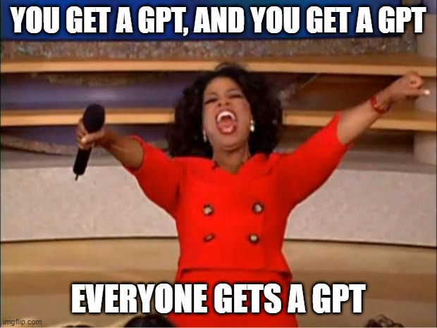

# MyGPTs :left_speech_bubble: 

The goal of this app is to allow everyone in an organization to create their own personalized GPT Chat Assistants with custom "rules" and knowledge sources (RAG), using a simple graphic user interface and without any coding.
<br>The initial setup is done by a developer or the IT department. If you already have access to an OpenAi API, Azure OpenAi API or have LM Studio running locally, this can be done in a few minutes. 
<br>When the app is launched, everyone with access to the app can create and chat with their own assistants.
<br>
<br>

## Features
__Assistants__
- Allow anyone to create and edit their own GPT Chat Assistants
- Add documents and websites to the assistant's knowledge base (Drag and drop RAG).
- No coding required


__Models__
<br>APIs currently supported:
 - Azure OpenAi
 - OpenAi
 - Local models served using LM Studio

<br>__Privacy__
<br> The only external data transfer happens when using OpenAi and Azure OpenAi APIs.
<br> If you want full privacy, use an open-source local model through LM Studio. In this case everything should run on-premise and no data will leave your organisation. 

__Languages__
<br>User interface languages currently supported:
- Danish

__Knowledge base sources currently supported__
<br>PDF, DOC, DOCX, MD, TXT, and web URLs

## Prerequisites

Before you can run this application, you need to have the following installed on your system:
- - A internal server (if others in the organization should be able to access the app, otherwise run on your local machine).
- [Python 3.10](https://www.python.org/downloads/)
- Pipenv installed using [PIXI](https://pixijs.io/)
```sh
pixi install pipenv
```
- An [Azure OpenAi](https://learn.microsoft.com/en-us/azure/ai-services/openai/) API key, an OpenAi API key or a local LLM running using [LM Studio](https://lmstudio.ai/)
- Your API key and endpoint must be set as environment variables in your terminal:

<br>_Here's an example for Windows with Azure API:_
```sh 
setx AZURE_OPENAI_ENDPOINT "https://<endpoint>.openai.azure.com/"
setx AZURE_OPENAI_KEY "<your Azure OpenAI API key>"
```
<br>_Here's an example for Windows with LM Studio:_
```sh
setx LOCAL_LLM_ENDPOINT "http://localhost:1234/v1"
setx LOCAL_LLM_KEY "not-needed"
```

## Usage
1.  Clone the repository to your local machine.

2. Navigate to the project directory in your terminal.
3. Install the project dependencies using Pipenv:
```sh
pipenv install
```
4. In the project directory, open _config/LLMs.yaml_ and add the APIs that you want to use.
5. Run the application:
```sh
pipenv run streamlit run app\Opret_assistent.py
```
6. A server should start up on port 8501 and a browser tab should open with the app interface. Share access and start building your GPTs. 
## Prototype in Beta
Please note that this app is currently in beta and is still a prototype. Breaking changes may occur as I continue to improve and refine the functionality. I appreciate your understanding and feedback as I work towards a stable release.

Version: 0.2.1

_Built using [Streamlit](https://streamlit.io/), [LangChain](https://www.langchain.com/) and [ChromaDB](https://www.trychroma.com/)._
____

____

